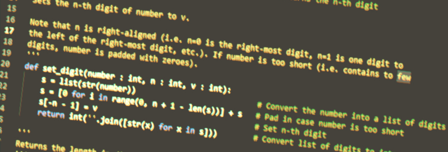
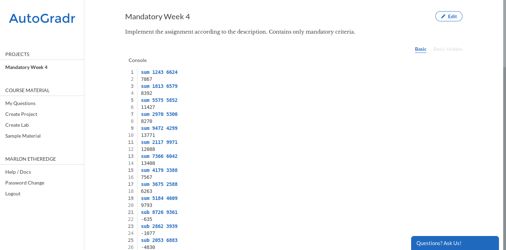

Introduction to Application Development in Python
====================

Description
-----------

The ability of software-engineers to analyze and solve problems and translate
solutions into correct computer programs can be seen as important and
fundamental skills. Throughout the study program as well as in a professional
career, these skills will continuously be called upon.

Introduction
------------

This course is complementary to the development- and analyse courses. However,
this course primarily focuses on the step-by-step implementation of a full
computer program. This implementation will build upon the knowledge acquired in
both development- and analyse courses. In addition, this course allows students
new to programming to get familiar with the software development environment,
the process of debugging software and the transformation of problem solutions to
working code. The result of this will be a computer program, written by the
student.

Homepage
--------

The course homepage can be found [here](https://hogeschool.github.io/Keuzevak-IADIP/).

Course documentation
--------------------

Please find the course description below.

[Course Description](docs/module-description.md)

Final assignment criteria
-------------------------

Please find the final assignment criteria below.

[Final Assignment](docs/final-assignment)

Make sure to use the course description and final assignment criteria documents frequently, as these describe how you can pass this course!

Starting point (code/ folder)
-----------------------------

The code folder can be found in the course [Github repository](https://github.com/hogeschool/Keuzevak-IADIP/tree/master/code).

Week schedule
-------------

| \#  | Contents                    | Programming tasks                               | Deadline |
| --- | --------------------------- | ----------------------------------------------- | -------- |
| 1   | Introduction, IDE, Debugger | IDE and required software, Program skeleton     | Week 2   |
| 2   | Functions and Conditionals  | Program skeleton for command-line processing    | Week 3   |
| 3   | Lists and String Operations | Processing command-line input (function syntax) | Week 4   |
| 4   | Loops (For and While)       | Arithmetic operations on integers (+,-,/,\*)    | Week 5   |
| 5   | Combination                 | Power, Square Root, GCD and LCM                 | Week 6   |
| 6   | Refinement\*                | Software refinement                             |          |
| 7   | Refinement\*                | Software refinement                             |          |

**Final assignment deadline: Week 8**

\* Depending on the experience levels of the students, the final software may be
improved to improve the grade. Depending on additional and optional criteria in
the assignment description.

Overview of assignments
-----------------------

Please find the weekly assignments below.

1. [Week 1](assignments/week1.md)
2. [Week 2](assignments/week2.md)
3. [Week 3](assignments/week3.md)
4. [Week 4](assignments/week4.md)
5. [Week 5](assignments/week5.md)

Slides
------

Please find the slides below.

- [Week
    1](https://hogeschool.github.io/Keuzevak-IADIP/presentations/week 1/presentation.html)
- [Week
    2](https://hogeschool.github.io/Keuzevak-IADIP/presentations/week 2/presentation.html)
- [Week
    3](https://hogeschool.github.io/Keuzevak-IADIP/presentations/week 3/presentation.html)
- [Week
    4](https://hogeschool.github.io/Keuzevak-IADIP/presentations/week 4/presentation.html)
- [Week
    5](https://hogeschool.github.io/Keuzevak-IADIP/presentations/week 5/presentation.html)

How to submit
-------------

Your code will be automatically verified according to the criteria found in the final assignment description. For the automatic verification, we make use of AutoGradr. Make sure to register an account at <http://AutoGradr.com>!

The criteria in the final assignment document are implemented as rules in AutoGradr, therefore your application should strictly adhere to these criteria. Each week has a project in AutoGradr. You will need to submit the code that implements the functionality as written in the weekly assignments with these projects in AutoGradr.

In AutoGradr you will find a number of test cases in the right region of your screen. Typically, half of the test cases are hidden and half of the test cases are visible. The test case itself is displayed in the left region. A blue line denotes input to your application, while a black line denotes the expected output from your application.

Below the test case, you can submit your application. Note that the name of the entry-point to your application should be *main.py*. In case your application consists of multiple files, you can upload a zip containing all the files.

Remember to check that the programming language is set to Python 3.

When you have uploaded your file(s), AutoGradr will automatically verify your solution and present you with the result. In case your solution does not pass, it will display the lines of output that are incorrect and what was expected. Please note that this is only shown for test cases that are visible and not for hidden test cases.

When your solution passes, AutoGradr will tell you that every test case has passed.

When to submit
--------------

Refer to the schedule above. We will keep track of your weekly progress which is part of your grade. We therefore require you to have passed each weekly assignment _before_ the deadline.