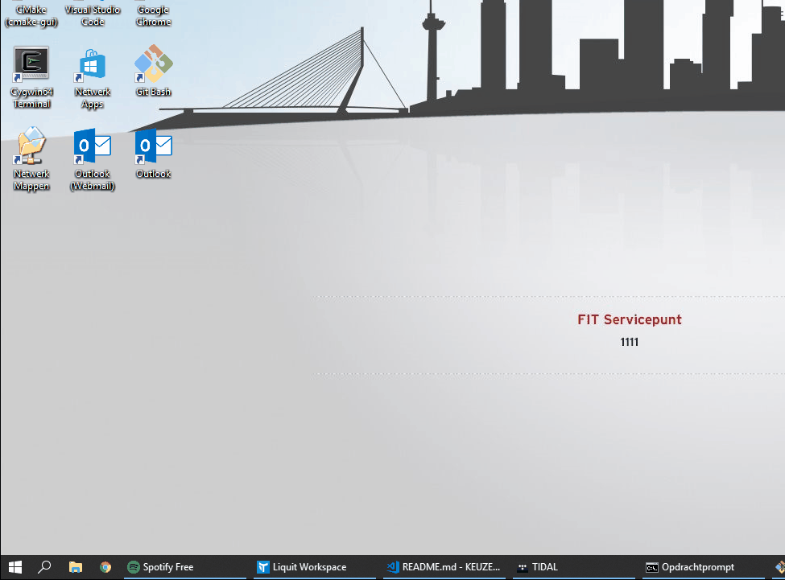

Week 1
=========================

Description
-----------

The topic of this week is the installation of Python, the integrated development environment (IDE), testing the debugger and getting familiar with the imposed structure of the final assignment.

At this time, please get familiar with the final assignment description. How to get familiar with this description can be read in section one.

Topics
------

- IDE
- The Python environment
- Debugger
- Modules

(1). Read the final assignment description
------------------------------------------

The course website (URL) contains a link to the description of the final assignment. As you know, this course consists of weekly assignments that contribute towards the final software program that is created during this course. The final software program, including the mandatory and optional criteria can be found in the assignment description.

Find the assignment description, read it and raise questions should the description be not clear.

(2). Installation of Python
---------------------------

During this course, we will work in the Python 3 programming language. You have already familiarized yourself with this programming language during the past courses. 

Please follow the following steps to install Python, should you not already have Python installed:

1. Go to <https://www.python.org/downloads/> and download the latest version of Python for your operating system.
2. Install run the installer and make sure to **add Python to your environment 'path' variable on Windows**\*.
3. Make sure that the 'python' (without quotes) command is available:
    1. For Linux and OSX\**, enter 'python' in a terminal, the Python shell should launch.
    2. For Windows, enter 'python' in command-prompt, the Python shell should launch.

\*: We want to make sure that Python is added to 'path', such that we can call the 'python' command without knowing the location of this program.

\**: For those using Mac OSX, Python comes pre-installed. However, this shipped version of Python is version 2. Make sure that Python 3 is installed and available in your terminal (e.g. by using *python3*).

(3). Installation of Visual Studio Code
---------------------------------------

Throughout this course, we will use the Visual Studio Code IDE with the Microsoft Python extension. By using this IDE, we have can make use of a great set of tools, including the debugger, that will aid in writing and testing code.

1. Follow the instructions for your operating system at <https://code.visualstudio.com/docs/setup/setup-overview> to install the Visual Studio Code IDE.
2. Follow the instructions at <https://code.visualstudio.com/docs/python/python-tutorial> to install the Python extension.

(4). Testing the debugger
-------------------------

Throughout this course, we will make use of [AutoGradr](http://www.autogradr.com/) as an automatic grading system. In this first programming assignment, correct the errors in [code/debugging_exercises.py](https://github.com/hogeschool/Keuzevak-IADIP/blob/master/code/debugging_exercises.py). The errors can be syntactical and logical. Use your newly installed IDE to resolve the errors in the code by using the linter and debugger.

Use the test cases in AutoGradr as a reference, also make use of the comments in the code.

Submit your working solution trough AutoGradr once you have passed all the test cases.
