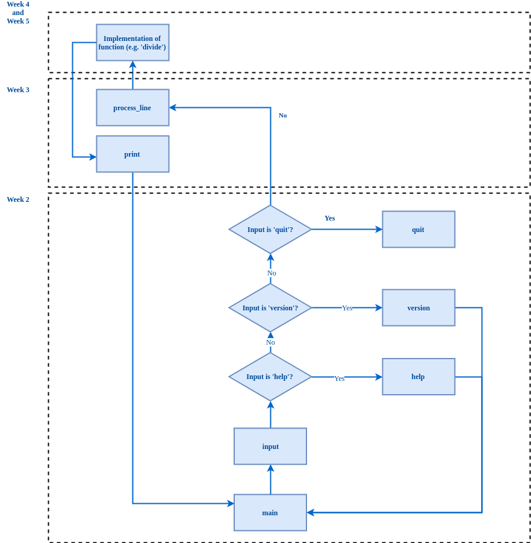

Week 2
=========================

Description
-----------

This week we will work on the basic application structure of our calculator. As should be known, the application that will be developed throughout this course is a text-based (that is, command-line) calculator which will feature several functions. Roughly, the implementation of the calculator can be represented by the logic and blocks depicted in the figure below.

In this assignment, we will focus on the basic functionality of reading input from the command-line, checking for *help* or *version* commands and providing a way for a user to cleanly *quit* the application. By cleanly, we mean that contrary to, a user forcing the application to quit (e.g. by killing the application in the task manager or even shutting down the computer) we implement logic to stop the application ourselves.

Topics
------

- Functions
- Main loop
- Conditions
- Output
- Input

Criteria
--------

(1) The main loop and reading input
-----------------

Many applications feature what is typically called the event loop (also called event loop, message pump, program loop, etc.). Since our calculator will act upon user input, for example; the user enters 'sum 1 1' into the calculator, the calculator calulates and prints the sum of the numbers *1* and *1* before waiting for another command to be entered by the user. In other words, our program does not stop after executing the command that the user entered, but instead waits for another command after having handled the first command.

The main loop of our calculator will first need to read input from the command-line entered by the user. Implement the main loop and make sure that this main loop reads the user input. The input will be necessary when we need to determine what the calculator should do according to a command entered by the user.

Please refer to the files in the [code/](https://github.com/hogeschool/Keuzevak-IADIP/blob/master/code/) directory, throughout this course, these files can provide you with a starting point for the implementation of the assignments. The provided files are:

- *code/arith_tools.py* provides tools to help implementing the arithmetic functions
- *code/arith.py* provides a starting point for the implementation of arithmetic functions
- *code/functions.py* contains storage and functions for the available functionality in our calculator
- *code/main.py* acts as and is a starting point for the calculator

Refer to [code/main.py](https://github.com/hogeschool/Keuzevak-IADIP/blob/master/code/main.py) as a starting point for the entry point of the calculator which will feature the main loop.

(2) The quit command
--------------------

The first command that needs to be implemented is the *quit* command. Upon entering the string *'quit'* (without quotes) the calculator should stop. In other words, in case we find the input to the calculator to be the string *'quit'*, we need to exit the main loop.

Implement the *quit* command.

(3) The help command
--------------------

The *help* command will present our user with the available commands. You need to implement a *help* function that displays the available commands to the user. Please make use of the function *print_functions* available in [code/functions.py](https://github.com/hogeschool/Keuzevak-IADIP/blob/master/code/functions.py). In case we find the input to the calculator to be the string *'help'*, we need to call our implemented *help* function that displays the available commands to the user. After calling the *help* function, the calculator needs to continue.

Implement the *help* command.

(4) The version command
-----------------------

The *version* command will present our user with the version of our application. You will need to implement the *version* command, such that when the user enters the string *'version'* into the console, the application displays the current version of the application. The output should be exactly 'calculator version 0.1'.

Implement the *version* command.

(5) Advanced
------------

In addition to console input that will be the main interface for entering commands into our calculator, it might be useful to allow for commands to be entered into the program arguments. Instead of starting the application and entering our commands via the console, we can start our application with arguments provided to the application that are executed.

An example, we might want to quickly get the output of the expression `2*5+10` by using our application in the following way:

`python main.py "sum multiply 2 5 10"`

Or get the available commands by using our application as such:

`python main.py --help`

Another extra that can be added to the calulator is the command *ans* that will store the result of the last operation once we get to the implementation of the mathematical functions of week 4 and 5.

(6) References
--------------

1. <https://docs.python.org/3.4/tutorial/inputoutput.html>
2. <https://docs.python.org/3/library/sys.html>
3. <https://www.python-course.eu/python3_formatted_output.php>
4. <https://docs.python.org/3/library/__main__.html>
5. <https://www.guru99.com/learn-python-main-function-with-examples-understand-main.html>
